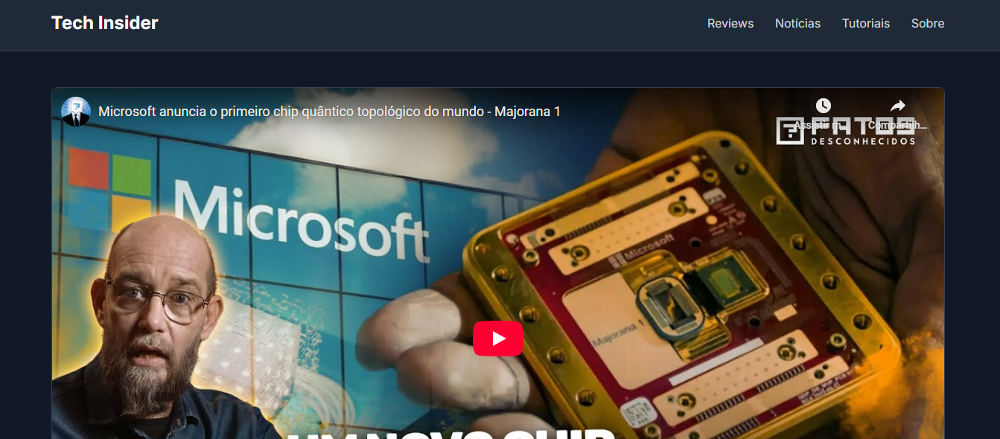

# Tracking de Engajamento de Vídeo

Este projeto simula uma implementação de tracking avançado para um cliente fictício de mídia, o **"Tech Insider Blog"**. O objetivo é demonstrar a capacidade de rastrear interações complexas dentro de componentes de terceiros, como um player de vídeo do YouTube.

## 1. Objetivo de Negócio do Cliente

O cliente investe significativamente na produção de conteúdo em vídeo, mas não possui dados para medir o seu engajamento. As perguntas de negócio eram:
- Os usuários estão de fato dando "play" nos vídeos?
- Até que ponto eles assistem antes de abandonar?
- Quais vídeos têm a maior taxa de conclusão?

## 2. Plano de Implementação (Mapa de Tags)

O plano de tracking foi desenhado para mapear a jornada de consumo do vídeo.

| Evento (`event`) | Acionador (Gatilho) | Dados Coletados (Payload) | Justificativa de Negócio |
| :--- | :--- | :--- | :--- |
| `video_start` | Usuário clica em "play" pela primeira vez. | `video_title`, `video_provider`, `video_duration` | Mede a taxa de início de visualização (Play Rate), KPI de atração. |
| `video_progress` | Usuário atinge 25%, 50% e 75% do vídeo. | `video_title`, `video_percent_complete` | Identifica pontos de abandono (drop-off) e o nível de engajamento. |
| `video_complete` | Usuário assiste o vídeo até o fim (95%+). | `video_title` | Mede a taxa de conclusão (Completion Rate), o principal KPI de retenção. |

## 3. Solução Técnica

Devido ao fato de o player do YouTube rodar em um `<iframe>`, o tracking não pôde ser feito com `addEventListener` tradicionais. A solução exigiu o uso da **API do IFrame Player do YouTube**.

- **Captura de Eventos:** O script carrega a API do YouTube e utiliza a função de `callback` `onYouTubeIframeAPIReady` para inicializar os players. As interações são capturadas através do `callback` `onStateChange`, que informa mudanças de estado (play, pause, fim).
- **Tracking de Progresso:** Um `setInterval` foi implementado para verificar proativamente o progresso do vídeo a cada segundo, disparando os eventos de `video_progress` quando os marcos (25%, 50%, 75%) são atingidos.
- **Multi-Player:** O script foi projetado para lidar com múltiplos players de vídeo na mesma página, criando e gerenciando instâncias e "flags" de progresso individualmente para cada um.

## 4. Tecnologias Utilizadas

- **JavaScript (ES6+)**
- **YouTube IFrame Player API**
- **HTML5 / CSS3**
- **Google Tag Manager (GTM)**
- **Google Analytics 4 (GA4)**